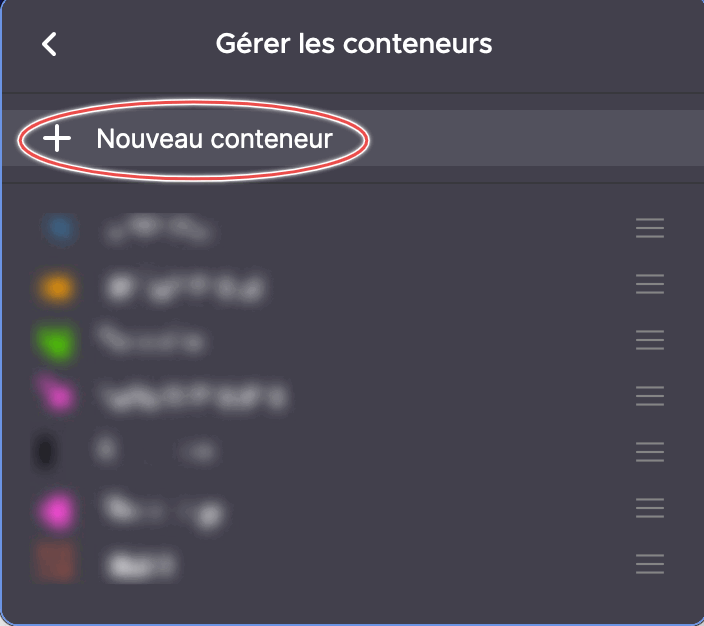
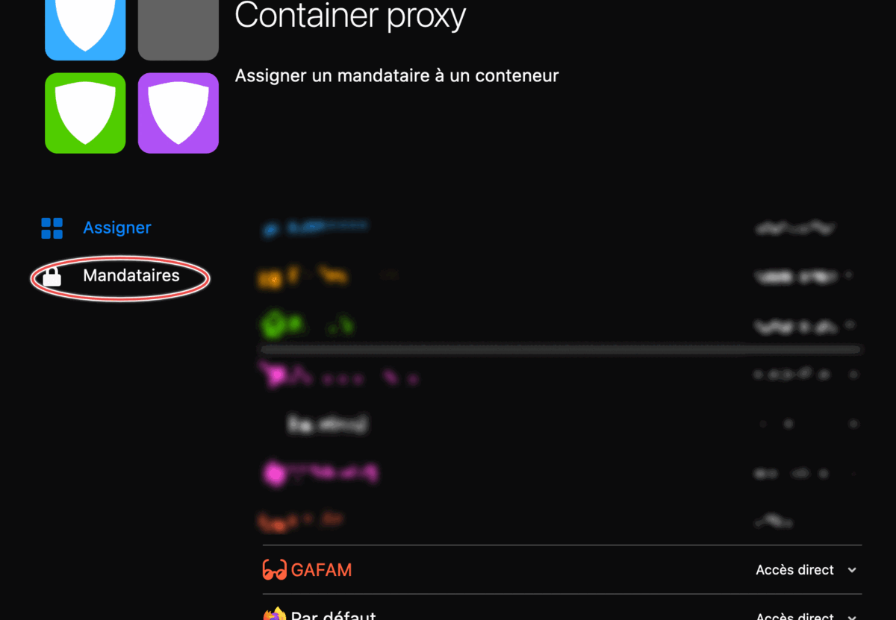
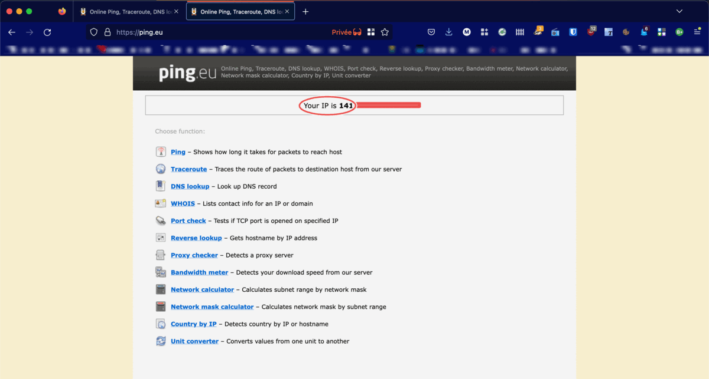

## 💬 What is this?
notrack-privacy is a project that used an open source solution called Squid as proxy.

The idea is to use Firefox as browser and use the extension Firefox container.

You can create a new container called GAFAM. When you open one of this website, they will be opened in the GAFAM container but we will a proxy so they will not have the real ip adresse.

We will our proxy server using docker. The proxy will be used within username and password.

## Show your support

Give a ⭐ if this project helped you!

<a href="https://www.buymeacoffee.com/belarbima" target="_blank"></a>

## 💻 Supported Architectures

This project supports multiple architectures such as `x86-64`, `arm64` [Raspberry-Ubuntu](https://ubuntu.com/download/raspberry-pi) and `armhf` [Raspberry-Raspbian](https://www.raspberrypi.com/software/operating-systems/).

**The architectures supported by this project are:**

| Architecture | Tag |
| :----: | --- |
| `x86-64` | `amd64-latest` |
| `arm64` | `arm64v8-latest` |
| `armhf` | `arm32v7-latest` |

## 💪 Quickstart

To get started all you need to do is clone the repository and spin up the containers.
```bash
git clone https://github.com/belarbi2733/notrack-privacy
```
```bash
cd notrack-privacy
```
### Create user and password to access to our proxy

We need to install `apache2-utils` to use `htpassword` to generate a new password

```bash
sudo apt update && sudo apt install apache2-utils -y
```
If this is the first time you create a user
```bash
htpassword -c conf/passwords user
#You will then asked for password
```
If you want to add more users
```bash
htpassword -b conf/passwords user
#You will then asked for password
```
After that you can start the docker service
```bash
docker-compose up -d
```
### How to use ?

You can use it as a normal proxy, but i will show a new way on how to use it
- You need Mozzila Firefox browser
- Install the `Multi Account Containers` addons [here](https://addons.mozilla.org/en-US/firefox/addon/multi-account-containers/)
- Install the `Container Proxy` addons [here](https://addons.mozilla.org/en-US/firefox/addon/container-proxy/)
- Go to the `Multi Account Containers` and create a new container for example GAFAM
<p align="center">
  
</p>
- Go to the `Container Proxy` and add a new proxy
- Configure the container GAFAM with the new proxy.
<p align="center">
  
</p>
- You see the results
<p align="center">
  
</p>

If you have any feedback, please reach out to us at tking031@posteo.net
## :clap:  Supporters
[](https://github.com/belarbi2733/notrack-privacy)

<p align="center"><a href="https://github.com/belarbi2733/notrack-privacy"></a></p>
<br/>
<p align="center"><a href="https://github.com/belarbi2733/notrack-privacy#"></a></p>
